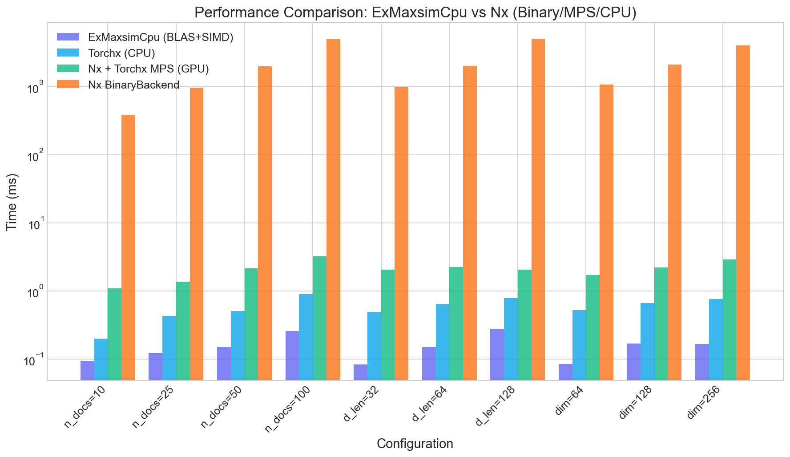
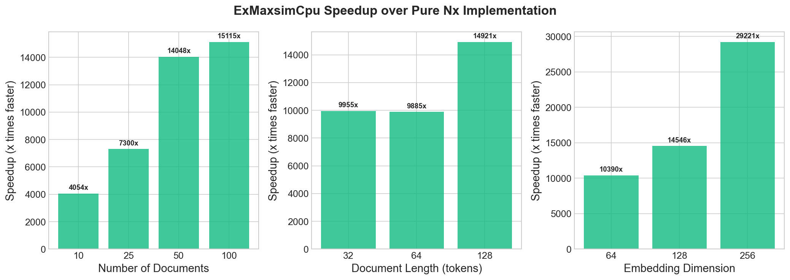
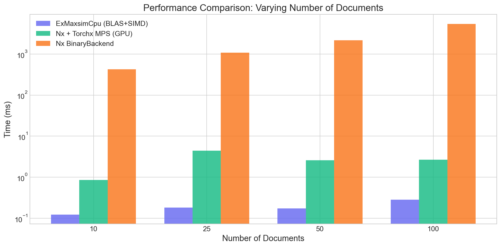
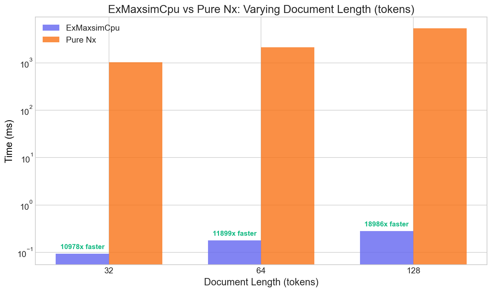
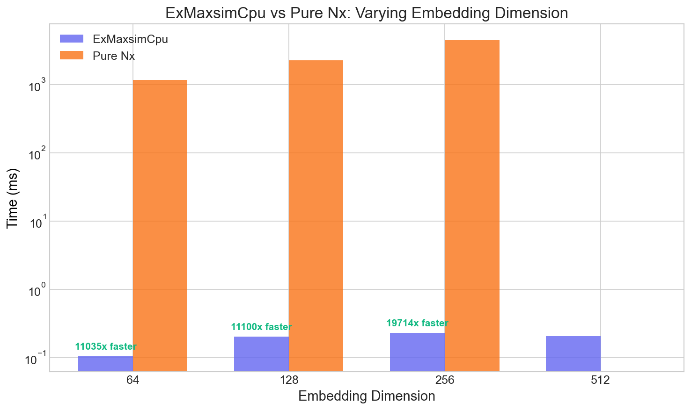

# ExMaxsimCpu

[](https://hex.pm/packages/ex_maxsim_cpu)
[](https://hexdocs.pm/ex_maxsim_cpu)

High-performance MaxSim (Maximum Similarity) scoring for Elixir using BLAS GEMM operations with SIMD acceleration.

## What is MaxSim?

MaxSim is a scoring function used in ColBERT-style neural retrieval models. For each query token, it finds the maximum similarity with any document token, then sums these maximums to produce the final score:

```
MaxSim(Q, D) = Σᵢ maxⱼ(Qᵢ · Dⱼ)
```

This library provides a highly optimized implementation using:
- **BLAS GEMM** for efficient matrix multiplication (OpenBLAS on Linux, Accelerate on macOS)
- **SIMD** for fast max reduction (AVX2 on x86_64, NEON on ARM64)
- **Rayon** for parallel document processing
- **Optional libxsmm** support for additional performance on Intel CPUs

## Installation

Add `ex_maxsim_cpu` to your dependencies in `mix.exs`:

```elixir
def deps do
  [
    {:ex_maxsim_cpu, "~> 0.1.0"},
    {:nx, "~> 0.7"}  # Required for tensor operations
  ]
end
```

### System Requirements

- **macOS (Apple Silicon)**: Uses Accelerate framework (no additional setup needed)
- **Linux x86_64**: Requires OpenBLAS; AVX2 is recommended for SIMD speedups
  ```bash
  # Ubuntu/Debian
  sudo apt-get install libopenblas-dev

  # Fedora/RHEL
  sudo dnf install openblas-devel
  ```
  For source builds that should use AVX2, set:
  ```bash
  export RUSTFLAGS="-C target-feature=+avx2"
  ```

### Rust Toolchain

This library uses Rustler to compile native code. Ensure you have Rust installed:

```bash
curl --proto '=https' --tlsv1.2 -sSf https://sh.rustup.rs | sh
```

## Usage

### With Nx Tensors (Recommended)

```elixir
# Create query tensor: [q_len, dim]
query = Nx.tensor([
  [0.1, 0.2, 0.3, 0.4],
  [0.5, 0.6, 0.7, 0.8]
], type: :f32)

# Create documents tensor: [n_docs, d_len, dim]
docs = Nx.tensor([
  [[0.1, 0.2, 0.3, 0.4], [0.5, 0.6, 0.7, 0.8]],
  [[0.9, 0.8, 0.7, 0.6], [0.5, 0.4, 0.3, 0.2]]
], type: :f32)

# Compute MaxSim scores
scores = ExMaxsimCpu.maxsim_scores(query, docs)
# => #Nx.Tensor<f32[2]>
```
Note: MaxSim expects L2-normalized embeddings. Normalize query and docs along the token axis before scoring.

### Variable-Length Documents

```elixir
query = Nx.tensor([[1.0, 0.0], [0.0, 1.0]], type: :f32)

# Documents with different lengths
doc1 = Nx.tensor([[1.0, 0.0], [0.0, 1.0], [0.5, 0.5]], type: :f32)  # 3 tokens
doc2 = Nx.tensor([[0.5, 0.5]], type: :f32)                          # 1 token

scores = ExMaxsimCpu.maxsim_scores_variable(query, [doc1, doc2])
```

### Raw Binary API (Advanced)

For maximum performance when you already have raw binary data:

```elixir
# Query and docs as native-endian f32 binaries
query_bin = <<1.0::float-32-native, 0.0::float-32-native, ...>>
docs_bin = <<...>>

scores_bin = ExMaxsimCpu.maxsim_scores_raw(
  query_bin, q_len, dim,
  docs_bin, n_docs, d_len
)

# Parse scores
scores = for <<score::float-32-native <- scores_bin>>, do: score
```

## Performance Tuning

### Environment Variables

- `RAYON_NUM_THREADS`: Control Rayon thread pool size (default: number of CPUs)
- `OPENBLAS_NUM_THREADS=1`: **Recommended** to avoid oversubscription with Rayon

### Example Configuration

```bash
export OPENBLAS_NUM_THREADS=1
export RAYON_NUM_THREADS=8
```

## libxsmm Support (Optional)

For additional performance on Intel CPUs, you can enable libxsmm:

1. Build libxsmm:
   ```bash
   git clone https://github.com/libxsmm/libxsmm.git
   cd libxsmm
   make -j$(nproc)
   export LIBXSMM_DIR=$(pwd)
   ```

2. Build with the feature enabled:
   ```bash
   cd native/maxsim_cpu
   cargo build --release --features use-libxsmm
   ```

## Benchmarks

ExMaxsimCpu delivers strong CPU performance, especially on small-to-moderate batch sizes:

### Benchmark Environment

- OS: macOS 26.2 (25C56)
- CPU: Apple M4 Pro (12 physical / 12 logical cores)
- Architecture: arm64
- Elixir: 1.19.5 (OTP 28)
- BLAS: Accelerate
- Env: OPENBLAS_NUM_THREADS=1, RAYON_NUM_THREADS=8
- Nx CPU backend: Torchx (CPU)

### Performance Summary

| Implementation | Typical Latency | vs ExMaxsimCpu |
|---------------|-----------------|----------------|
| **ExMaxsimCpu** (BLAS+SIMD) | 0.08 - 0.28 ms | — |
| Nx CPU backend (Torchx) | 0.20 - 0.89 ms | ~4x slower |
| Nx + Torchx MPS (Apple GPU) | 1.09 - 3.24 ms | ~15x slower |
| Nx BinaryBackend (unaccelerated) | 386 - 5,038 ms | ~13,800x slower |

Notes:
- Nx BinaryBackend is an unaccelerated baseline; EXLA/Torchx CPU will be faster.
- Nx CPU backend results (EXLA or Torchx) are included when available.
- MPS timings are for small shapes where transfer overhead can dominate.
- Results are machine- and shape-dependent; run your own benchmarks for production sizing.

### Performance Comparison



*Benchmark on Apple Silicon (this run), showing ExMaxsimCpu (blue), Nx BinaryBackend (orange), and optional Nx CPU/MPS backends on a log scale.*

### Speedup Analysis

| Comparison | Speedup Factor |
|------------|----------------|
| vs Nx BinaryBackend | **4,100x - 24,200x** |
| vs Nx CPU backend (Torchx) | **2.1x - 6.2x** |
| vs Nx + Torchx MPS (GPU) | **7.5x - 24.6x** |



### Why can CPU win on these shapes?

1. **Optimized BLAS**: Uses Apple Accelerate (or OpenBLAS on Linux) which is highly tuned for the CPU architecture
2. **SIMD Instructions**: Hand-optimized AVX2/NEON code for max-reduction operations
3. **No Transfer Overhead**: GPU implementations incur memory transfer costs
4. **Cache Efficiency**: Tiled algorithms keep data in CPU cache

### Detailed Comparisons

<details>
<summary>Click to expand individual benchmark charts</summary>

#### Varying Number of Documents


#### Varying Document Length


#### Varying Embedding Dimension


</details>

### Running Benchmarks

Generate benchmark data (includes optional MPS and Nx CPU backends when available):
```bash
OPENBLAS_NUM_THREADS=1 mix run bench/generate_plots.exs
```

Generate plots:
```bash
uv run bench/plot_benchmarks.py
```

> **Note:** For MPS benchmarks, ensure `torchx` is installed. For Nx CPU backends, install `torchx` or add `exla` to your dev deps. The benchmark auto-detects availability.

## Platform Support

| Platform | Architecture | Status |
|----------|-------------|--------|
| macOS | arm64 (Apple Silicon) | ✅ Fully supported |
| Linux | x86_64 (AVX2) | ✅ Fully supported |
| Linux | arm64 | ⚠️ Should work (untested) |
| Windows | Any | ❌ Not supported |

## License

MIT License - see [LICENSE](LICENSE) for details.

## Credits

This is the Elixir binding for [maxsim-cpu](https://github.com/mixedbread-ai/maxsim-cpu), a high-performance MaxSim implementation in Rust.
